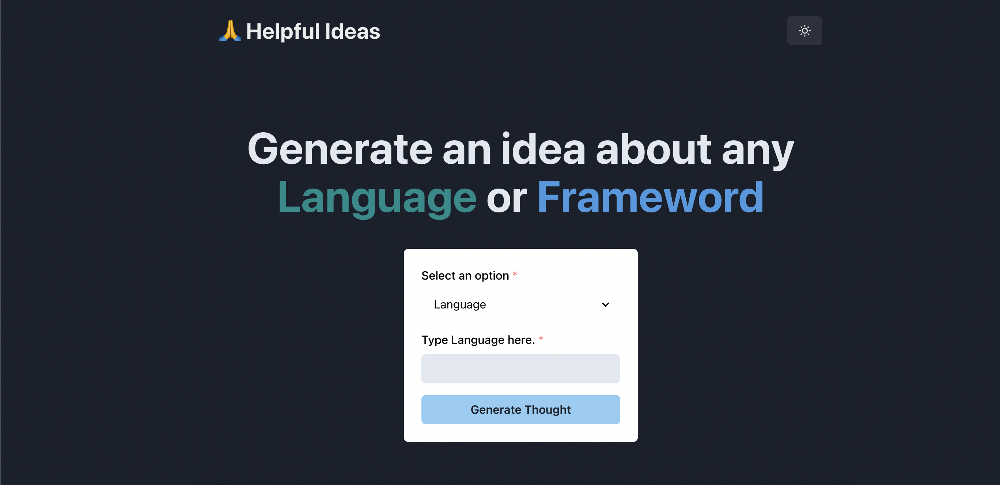

# [Ai-ideas](https://ai-ideas.vercel.app/)

Ai-ideas is a web application that allows users to input a language or a framework, and generates a sentence of infos in return.

[](https://ai-ideas.vercel.app/)


## How it works

This project uses the [OpenAI GPT-3 API](https://openai.com/api/) (specifically, text-davinci-003). It asks a user to select from a dropdown a language or framework as an input. Then sends it to the GPT-3 API  and sends the response back to the application.

## Running Locally

After cloning the repo, go to [OpenAI](https://beta.openai.com/account/api-keys) to make an account and put your API key in a file called `.env`.

Then, run the application in the command line and it will be available at `http://localhost:3000`.

```bash
npm install
npm run dev
```

## One-Click Deploy

Deploy the example using [Vercel](https://vercel.com?utm_source=github&utm_medium=readme&utm_campaign=vercel-examples):
 
[](https://vercel.com/)

* Make sure to include environment variable in Vercel Environmental Veriables

